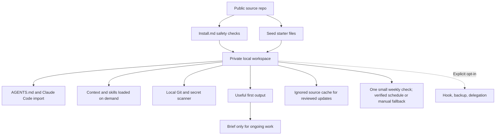

# Business AI Starter Kit Architecture

The public repo supplies a seed; each installed workspace is an independent
private local folder. The source cache is disposable and ignored by Git.

## Operating Defaults

One agent uses the current model and relevant sources. Brief user/business
onboarding and profile confirmation are required before setup completes. One-off work needs no project scaffold. Ongoing work starts with a
brief and output; additional trackers are created only when warranted.

Setup includes one small weekly maintenance check with confirmed timing and
host consent, or a documented blocker and manual weekly fallback. Reviews
inspect a narrow scope. No meaningful change means no status edits,
log, commit, or scheduled notification. An activity hint is not a complete
change record and does not prevent the cost of starting an AI run.

Codex and Claude Code share instruction and skill files. Cowork and other
harnesses need a separate check of current documentation. Avoid simultaneous
edits to shared files.

## Detailed Flows

- [Full system](Architecture/full-system-flow.md)
- [Repository responsibilities](Architecture/repository-responsibilities.md)
- [Installed workspace](Architecture/installed-workspace-model.md)
- [First setup](Architecture/first-setup-flow.md)
- [Maintenance](Architecture/self-improvement-loop.md)
- [Templates](Architecture/templates-flow.md)
- [Updates](Architecture/update-and-migration-flow.md)
- [Safety](Architecture/safety-gates.md)
- [Mind map](Architecture/architecture-mindmap.md)
- [Model and skill review](Architecture/model-and-skill-review.md)

Keep diagrams aligned with [Seed/AGENTS.md](Seed/AGENTS.md). Use one logical
Mermaid diagram per file and link new documents from the architecture index.

## Validation And Boundaries

`pnpm check` audits files and scans for secrets. `pnpm check:context` tests
bounded hook output, read-only behavior, and workspace activity hints in an
isolated fixture. Manual behavioral scenarios are in the model/skill review.

The optional startup hook emits metadata and navigation pointers, not file
contents. The gate inspects workspace evidence, not home session histories.
Neither helper installs a schedule or authorizes external actions.

There is no UI, SaaS backend, or automatic project execution. Project and app
templates remain deferred; the optional startup hook is the current exception.
Private data never belongs in this public repo.

## Optional Cross-Project Work

- [Portable context bridge](Architecture/portable-context-bridge.md): exact-preview approval, detached snapshots, explicit consumer invocation, and revocation limits.
- [Orchestrated work](Architecture/orchestrated-work-flow.md): one-agent default with approved bounded workers, exclusive ownership, evidence, and integration.
