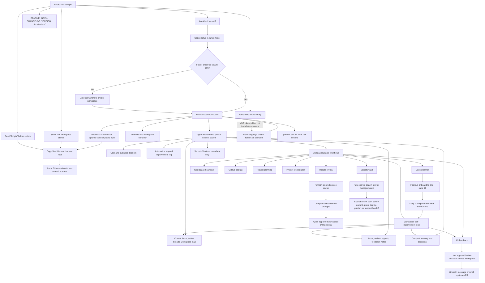

# Business AI Starter Kit Architecture

This is the high-level MVP architecture map. Detailed flow diagrams live in
[Architecture/](Architecture/README.md). Markdown and Mermaid are the source of
truth for architecture until a heavier visual layer is deliberately introduced.

## Editing Standard

- Keep this file as the high-level map.
- Keep detailed diagrams in [Architecture/](Architecture/README.md).
- Use one Mermaid diagram per file.
- Do not use custom imports or render tooling for MVP.
- Keep diagrams readable by humans, AI agents, Git diffs, GitHub, VS Code,
  Obsidian, Typora, and Mermaid Live Editor.
- If a diagram gets hard to edit, split it into smaller files and link them
  from [Architecture/README.md](Architecture/README.md).

## System Overview

## Diagram Index

- [Full System Flow](Architecture/full-system-flow.md)
- [Repository Responsibilities](Architecture/repository-responsibilities.md)
- [Installed Workspace Model](Architecture/installed-workspace-model.md)
- [First Setup Flow](Architecture/first-setup-flow.md)
- [Self-Improvement Loop](Architecture/self-improvement-loop.md)
- [Templates Flow](Architecture/templates-flow.md)
- [Update And Migration Flow](Architecture/update-and-migration-flow.md)
- [Safety Gates](Architecture/safety-gates.md)
- [Architecture Mind Map](Architecture/architecture-mindmap.md)

## Core Model

Business AI Starter Kit has two sides:

- Public repo: source library, install handoff, seed files, scripts, future
  templates, architecture docs, license, security policy, and contribution guidance.
- Private workspace: the user's local business context, projects, memory,
  automations, secrets metadata, and working files.

The user's workspace is not a fork of the public kit and not a package install.
It is an independent local workspace with an ignored clone of the public repo at
`.business-ai-kit/source/` for source reference and update review.

The public repo should never contain a user's private business context, client
files, real credentials, or raw secrets.

## MVP Boundaries

Included now:

- Codex-first install flow.
- Private workspace seed with real starter files, not `.template` files.
- Local Git and pre-commit secret scanning.
- `.business-ai-kit/source/` ignored source-cache update model.
- `Agent-Instructions/` context, memory, inbox/outbox, signal, feedback, and state system.
- Skills for Codex learning, daily heartbeat, private GitHub backup, kit feedback, project planning, secrets, and updates.
- Daily checkpoint workspace heartbeat instructions.
- Local `.env` fallback and Doppler guidance for secrets.
- Future templates placeholder.
- Soft support references.
- User-approved feedback path for LinkedIn messages or focused upstream PRs.

Deferred:

- Full Hermes runtime dependency.
- Full autonomous project execution without explicit user authorization.
- SaaS backend or UI.
- Project/app templates in v1.
- Full provider adapters for Infisical or 1Password.
- Cross-agent sync beyond the current skills-compatible structure.
- Vibe Canvas or any visual architecture app.
