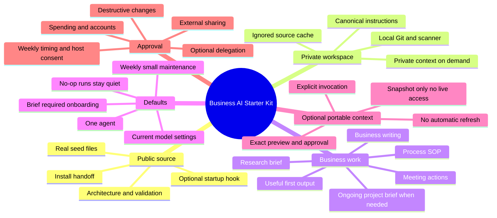

# Architecture Mind Map

A compact map of responsibilities. Detailed procedures live in the owning skills.

See [workspace rules](../Seed/AGENTS.md) for canonical behavior and the
[architecture index](README.md) for related flows.
