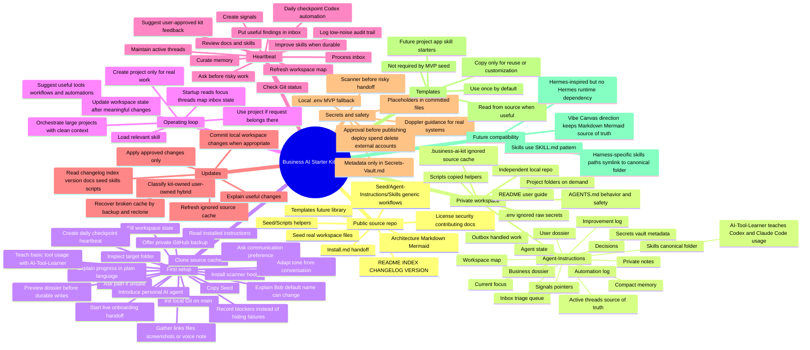

# Architecture Mind Map

This mind map is the quick-edit view of the MVP architecture.

```mermaid
mindmap
  root((Business AI Starter Kit MVP))
    Public source repo
      Install.md handoff
      Seed real workspace files
      Seed/Scripts helpers
      Seed/Agent-Instructions/Skills generic workflows
      Templates future library
      README INDEX CHANGELOG VERSION
      Architecture Markdown Mermaid
      License security contributing docs
    Private workspace
      Independent local repo
      AGENTS.md behavior and safety
      README user guide
      Agent-Instructions
        User dossier
        Business dossier
        Current focus
        Active threads source of truth
        Inbox triage queue
        Outbox handled work
        Workspace map
        Compact memory
        Decisions
        Agent state
        Automation log
        Improvement log
        Private notes
        Secrets vault metadata
        Skills canonical folder
          AI-Tool-Learner teaches Codex and Claude Code usage
        Signals pointers
      Scripts copied helpers
      Project folders on demand
      .business-ai-kit ignored source cache
      .env ignored raw secrets
    First setup
      Inspect target folder
      Ask path if unsafe
      Clone source cache
      Copy Seed
      Init local Git on main
      Install scanner hook
      Read installed instructions
      Explain progress in plain language
      Start live onboarding handoff
      Teach basic tool usage with AI-Tool-Learner
      Introduce personal AI agent
      Explain Bob default name can change
      Ask communication preference
      Adapt tone from conversation
      Gather links files screenshots or voice note
      Preview dossier before durable writes
      Fill workspace state
      Create daily checkpoint heartbeat
      Offer private GitHub backup
      Record blockers instead of hiding failures
    Operating loop
      Startup reads focus threads map inbox state
      Load relevant skill
      Use project if request belongs there
      Create project only for real work
      Suggest useful tools workflows and automations
      Orchestrate large projects with clean context
      Update workspace state after meaningful changes
    Heartbeat
      Daily checkpoint Codex automation
      Process inbox
      Check Git status
      Maintain active threads
      Refresh workspace map
      Curate memory
      Review docs and skills
      Improve skills when durable
      Put useful findings in inbox
      Create signals
      Log low-noise audit trail
      Ask before risky work
      Suggest user-approved kit feedback
    Updates
      Refresh ignored source cache
      Recover broken cache by backup and reclone
      Read changelog index version docs seed skills scripts
      Classify kit-owned user-owned hybrid
      Explain useful changes
      Apply approved changes only
      Commit local workspace changes when appropriate
    Secrets and safety
      Local .env MVP fallback
      Doppler guidance for real systems
      Metadata only in Secrets-Vault.md
      Placeholders in committed files
      Scanner before risky handoff
      Approval before publishing deploy spend delete external accounts
    Templates
      Not required by MVP seed
      Read from source when useful
      Use once by default
      Copy only for reuse or customization
      Future project app skill starters
    Future compatibility
      Hermes-inspired but no Hermes runtime dependency
      Skills use SKILL.md pattern
      Harness-specific skills paths symlink to canonical folder
      Vibe Canvas direction keeps Markdown Mermaid source of truth
```
