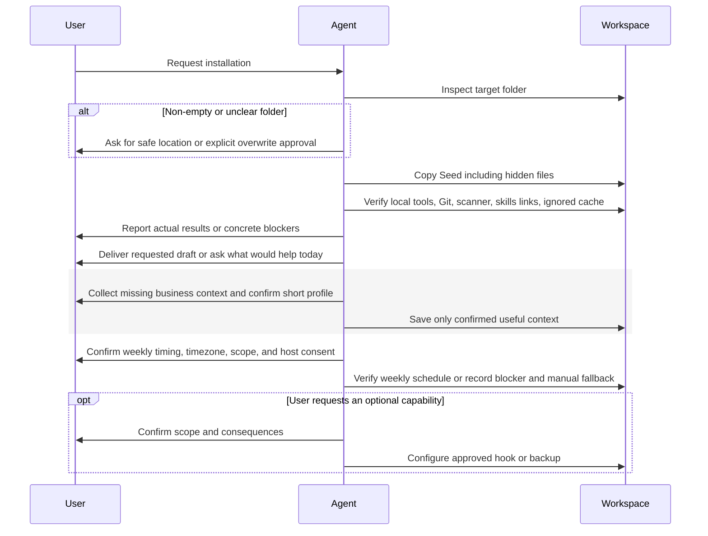

# First Setup Flow

Install preserves existing files. Brief onboarding, confirmed context, and weekly maintenance setup are required; a useful draft can be delivered along the way.

See [workspace rules](../Seed/AGENTS.md) for canonical behavior and the
[architecture index](README.md) for related flows.
