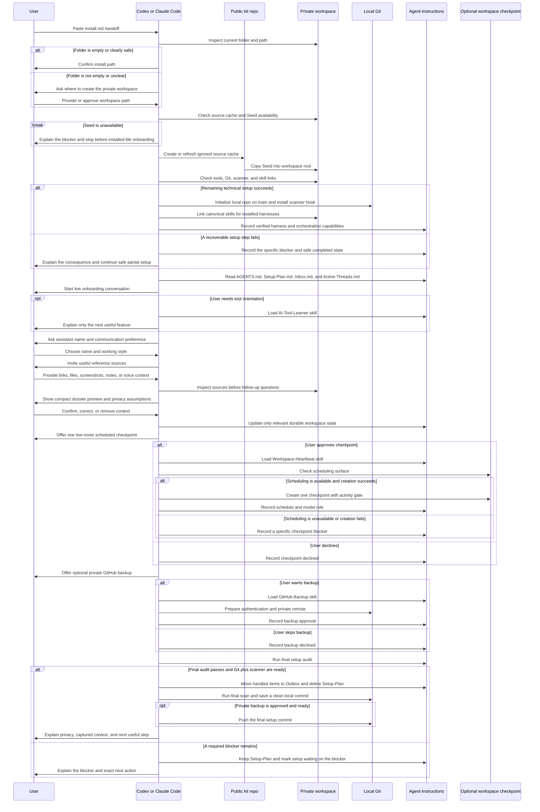

# First Setup Flow

This sequence shows the MVP installation and onboarding path for either
supported harness. The private workspace is independent from the public repo;
`.business-ai-kit/source/` is an ignored disposable source cache.

