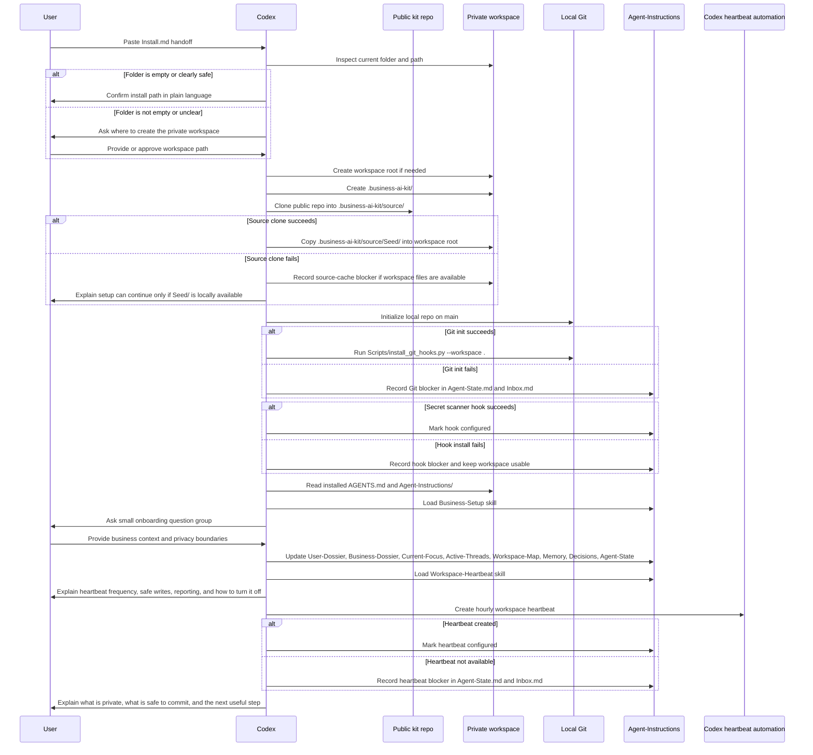

# First Setup Flow

This sequence shows the exact MVP installation and onboarding path. The
workspace is independent from the public repo; `.business-ai-kit/source/` is a
disposable ignored clone used for updates and source reference.

