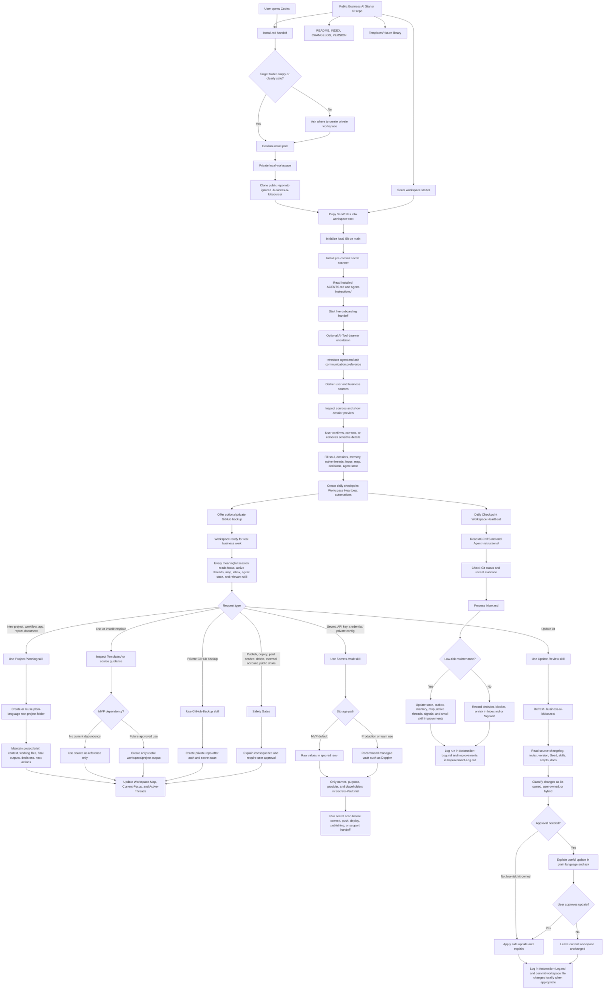

# Full System Flow

This is the MVP lifecycle source-of-truth diagram. It ties together install,
workspace ownership, first-run setup, normal work, heartbeat, updates, secrets,
templates, and safety boundaries.

The diagram should match the installed `Seed/` behavior, repository docs, and
MVP boundaries.

