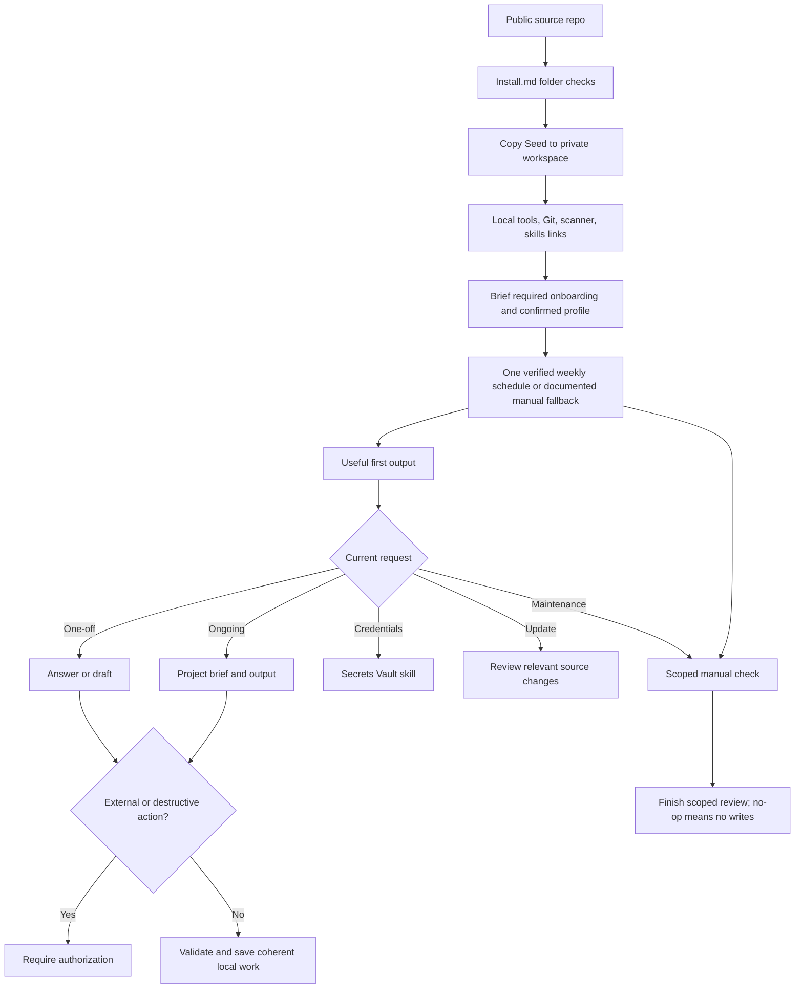

# Full System Flow

The public source and private workspace remain separate. Each task loads only the context it needs.

See [workspace rules](../Seed/AGENTS.md) for canonical behavior and the
[architecture index](README.md) for related flows.
