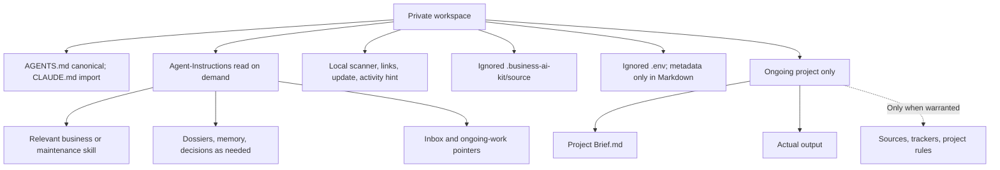

# Installed Workspace Model

Files are available for continuity, not a requirement to read or update all of them at startup.

See [workspace rules](../Seed/AGENTS.md) for canonical behavior and the
[architecture index](README.md) for related flows.
