# Installed Workspace Model

This diagram shows the expected MVP private workspace after setup. The visible
root stays simple; durable agent context lives under `Agent-Instructions/`;
projects are created in the root only when real work starts.

```mermaid
flowchart TD
  Root["Private workspace root"] --> Agents["AGENTS.md"]
  Root --> Readme["README.md"]
  Root --> Gitignore[".gitignore"]
  Root --> EnvExample[".env.example"]
  Root --> AgentInstructions["Agent-Instructions/"]
  Root --> Scripts["Scripts/"]
  Root --> Kit[".business-ai-kit/"]
  Root --> Projects["Project folders created on demand"]

  Kit --> Source["source/ ignored public kit clone"]
  Kit --> Backups["backups/ ignored source-cache backups"]
  Kit --> Tmp["tmp/ ignored temporary update work"]

  Root --> Package["package.json"]
  Scripts --> Scan["secret_scan.mjs"]
  Scripts --> Hooks["install_git_hooks.mjs"]
  Scripts --> Update["update_kit.mjs"]
  Scripts --> Gate["heartbeat_gate.mjs"]

  AgentInstructions --> User["User-Dossier.md"]
  AgentInstructions --> Business["Business-Dossier.md"]
  AgentInstructions --> Focus["Current-Focus.md"]
  AgentInstructions --> Threads["Active-Threads.md continuity source"]
  AgentInstructions --> Inbox["Inbox.md triage queue"]
  AgentInstructions --> Outbox["Outbox.md handled work record"]
  AgentInstructions --> Map["Workspace-Map.md"]
  AgentInstructions --> Memory["Memory.md compact durable memory"]
  AgentInstructions --> Portable["Portable-Context.md optional approved projection"]
  AgentInstructions --> Decisions["Decisions.md"]
  AgentInstructions --> State["Agent-State.md setup and permissions"]
  AgentInstructions --> AutomationLog["Automation-Log.md"]
  AgentInstructions --> ImprovementLog["Improvement-Log.md"]
  AgentInstructions --> PrivateNotes["Private-Notes.md private context"]
  AgentInstructions --> SecretsVault["Secrets-Vault.md secret metadata only"]
  AgentInstructions --> SetupPlan["Setup-Plan.md temporary first-run checklist"]
  AgentInstructions --> Skills["Skills/ canonical workflows"]
  AgentInstructions --> Signals["Signals/ coordination pointers"]

  Skills --> ToolLearner["AI-Tool-Learner/SKILL.md"]
  Skills --> Heartbeat["Workspace-Heartbeat/SKILL.md"]
  Skills --> GithubBackup["GitHub-Backup/SKILL.md"]
  Skills --> Feedback["Kit-Feedback/SKILL.md"]
  Skills --> Planning["Project-Planning/SKILL.md"]
  Skills --> Orchestrator["Project-Orchestrator/SKILL.md"]
  Skills --> Secrets["Secrets-Vault/SKILL.md"]
  Skills --> UpdateReview["Update-Review/SKILL.md"]
  Skills --> PortableManager["portable-workspace-context/SKILL.md"]

  Portable --> PortableManager
  PortableManager -. "approved physical snapshot; outside workspace" .-> GlobalSkills["User-level Codex or Claude skill"]
  GlobalSkills -. "no live path or write-back" .-> Root

  Signals --> Incoming["Incoming.md"]
  Signals --> Outgoing["Outgoing.md"]
  Signals --> SignalsReadme["README.md"]

  Projects --> Minimum["Minimum project structure"]
  Minimum --> ProjectBrief["Project Brief.md"]
  Minimum --> Working["Working Files/"]
  Minimum --> Final["Final Outputs/"]

  Projects --> Optional["Add only when needed"]
  Optional -.-> ProjectContext["Project Context/"]
  Optional -.-> ProjectDecisions["Decisions.md"]
  Optional -.-> NextActions["Next Actions.md"]
  Optional -.-> Executive["Executive Brief.md"]
  Optional -.-> Archive["Archive/"]
  Optional -.-> OptionalAgents["Project AGENTS.md and CLAUDE.md"]

  Orchestrator --> Lead["Lead owns scope, integration, and final result"]
  Orchestrator --> Workers["Bounded workers with exclusive write scopes"]
  Orchestrator --> Reviewer["Independent reviewer when risk justifies it"]
  Orchestrator --> Fallback["Sequential fallback when native agents are unavailable"]
```

