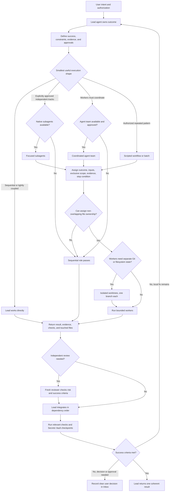

# Orchestrated Work Flow

This is the execution control plane for substantial work. It is shared across
Codex and Claude Code even when their native agent features differ.

## Role Policy

One agent and the current model/settings are the default. Delegation requires
an explicit request or approved bounded plan, including its additional usage.
The lead owns decomposition and integration; workers own bounded outputs; a
reviewer checks evidence independently when warranted and authorized.

Verify native capabilities before selecting subagents, teams, workflows, or
worktrees. If unavailable, use sequential passes with the same ownership and
evidence requirements. Do not upgrade models or reasoning by role automatically.

## Boundaries

- Native agent state stays in the harness. Workspace files hold only durable
  business state, decisions, evidence, and cross-session handoffs.
- Workers do not inherit authority to publish, spend, connect accounts, expose
  secrets, or expand project scope.
- When portable context is used, the lead loads the selected snapshot and gives
  workers only the minimum relevant excerpt instead of distributing the full snapshot.
- Parallel writers need non-overlapping ownership or worktree isolation.
- Check current host documentation before using experimental orchestration
  features. None is required for normal workspace work.
- Persistent cross-harness agent networking remains outside the MVP.
