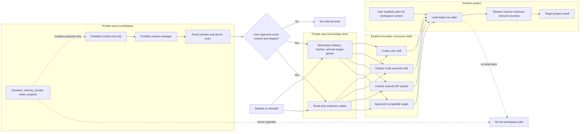

# Portable Context Bridge

This flow shows the optional, one-way bridge from a private workspace into other local AI projects. The global consumer receives a reviewed snapshot, never live workspace access.

## Invariants

- Only `Portable-Context.md` is eligible for export.
- Preview, secret scan, and approval happen before every install or refresh.
- Installed skills are physical, self-contained copies with no source-workspace path.
- The consumer is explicit-invocation, integrity-checks snapshots, and cannot write back.
- Active-project instructions remain authoritative.
- Multiple source workspaces use unique aliases; the lead does not guess among them.
- Disable and uninstall stop future reads but cannot erase existing conversation history or separately uploaded copies.
- Local storage is not local inference: explicit invocation allows the active AI service to process the approved snapshot under its provider data controls.
