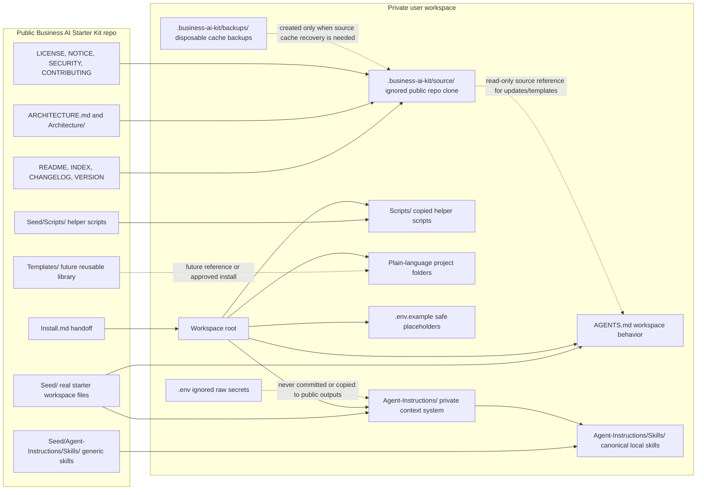

# Repository Responsibilities

This diagram defines public-source ownership versus private-workspace ownership.
The user workspace is not a fork of the public kit. The public repo is copied
and referenced through an ignored local source cache.

