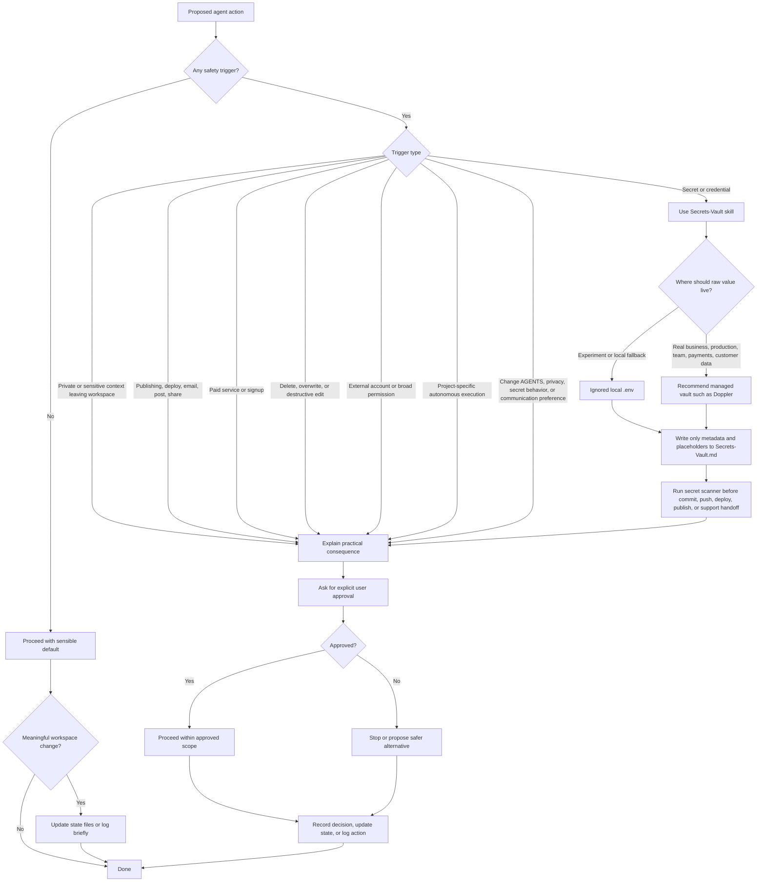

# Safety Gates

This diagram defines when the agent can proceed, when it must ask, and how
secrets are routed through the separate secret-handling model.

Must ask first:

- publishing, deploying, emailing, posting, sharing, or making work public
- spending money or signing up for paid services
- deleting or overwriting user work
- moving private notes into public or client-facing outputs
- changing `AGENTS.md`, privacy rules, secret behavior, or communication preferences
- connecting external accounts or granting broad permissions
- storing, exposing, rotating, or migrating raw credentials
- autonomous project-specific work beyond explicit authorization
