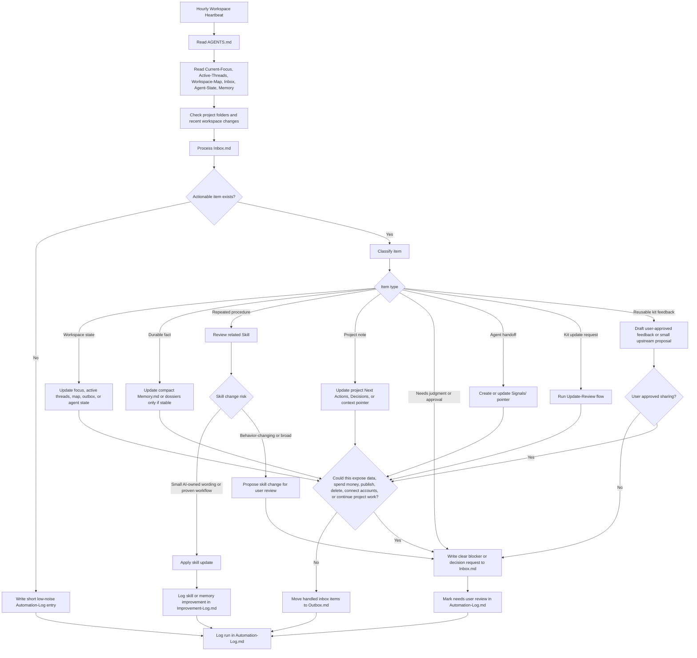

# Self-Improvement Loop

The self-improvement loop is the Hermes-inspired heartbeat adapted for Codex.
It is mandatory after first setup, but it is not permission for autonomous
project execution. It maintains the workspace, processes the inbox, improves
procedures, and records anything that needs user judgment.

Rules:

- `Active-Threads.md` is the continuity source of truth.
- Facts belong in dossiers or memory.
- Procedures belong in skills.
- Active project work belongs in project files and active threads.
- `Inbox.md` is the default place for user decisions and blockers.
- `Signals/` is a pointer channel for automations and future agents.
- Secrets never belong in markdown.
- Noisy heartbeat runs should log briefly and leave files alone.
- Project-specific autonomous work needs explicit user authorization.
- Public kit feedback is opt-in only: draft a LinkedIn message or one focused PR after user approval.
