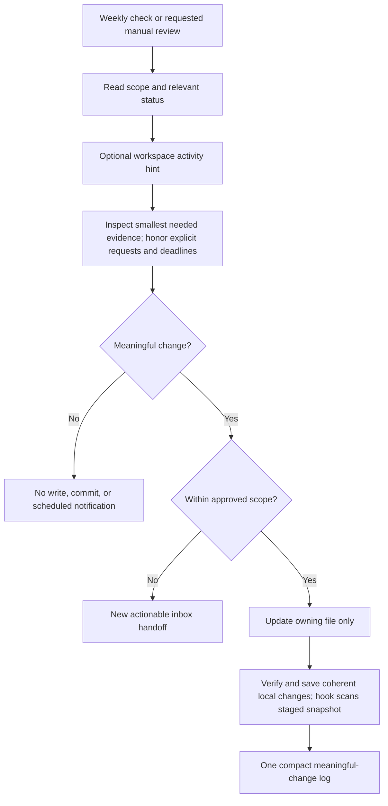

# Weekly Maintenance

Setup includes one small weekly check with confirmed local scope, timing, timezone, and host consent. If scheduling is unavailable, record a blocker and manual weekly fallback.

See [workspace rules](../Seed/AGENTS.md) for canonical behavior and the
[architecture index](README.md) for related flows.
