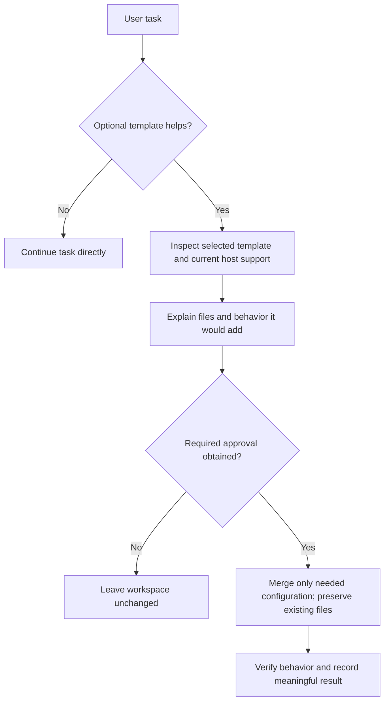

# Templates Flow

The optional startup hook is the current template. Project and app templates remain future-facing; normal seed installation does not depend on them.

See [workspace rules](../Seed/AGENTS.md) for canonical behavior and the
[architecture index](README.md) for related flows.
