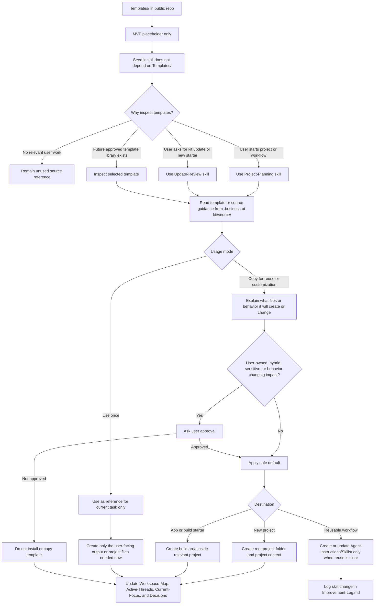

# Templates Flow

Templates are future-facing in MVP v1. The installed seed does not depend on
templates, and templates are not copied by default. The public repo can still
act as a reference library for future project, app, skill, or workflow starters.

