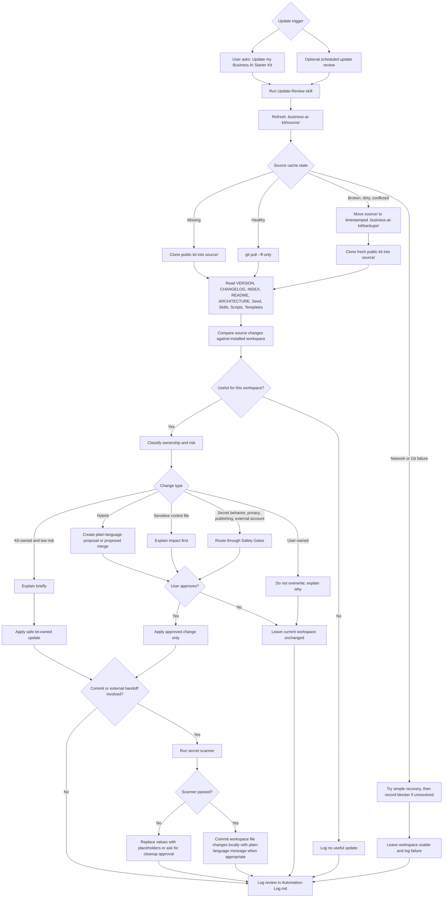

# Update And Migration Flow

This diagram shows the safe update path from the ignored public source cache
into a private user workspace. Update review is inspect-first and approval-first
for anything user-owned, hybrid, sensitive, or behavior-changing.

